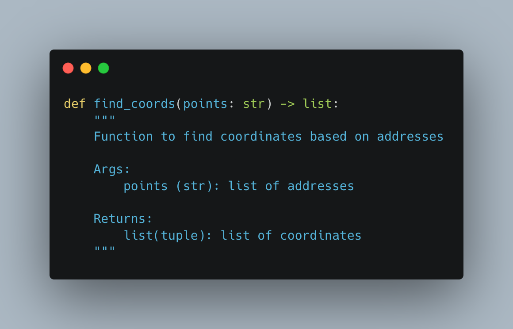
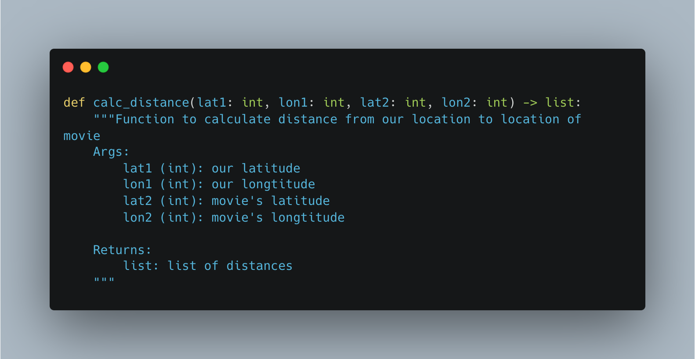
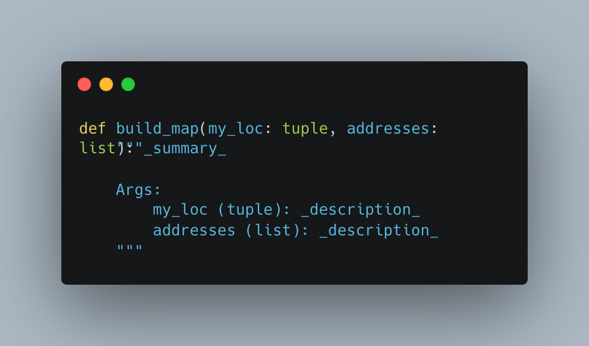

# map builder

Map builder is a module to create map with markers of movies of certin year, which are located closest to a certain point

## Usage

Enter required arguments into the comand line

```python
python3 /Users/julia/Desktop/OP/week_1/map/lab1_2.py 2014 49.83826 24.02324 'path to file with films'
```

## Example of file to get info from


## Fuctional

In the module functions are called through argparse, using comandline.


Function to read data from file



Function gets list of locations and returns their coordinates



Function to calculate distance from your location to place, where movie was filmed



Function to build map with 3 layers and a minimap:    
    - the map itself
    - markers
    - circle marcers

.png)

The main body of module with argument parser

## Contributing

Any improvements are very welcomed!

## License

[MIT](https://choosealicense.com/licenses/mit/)