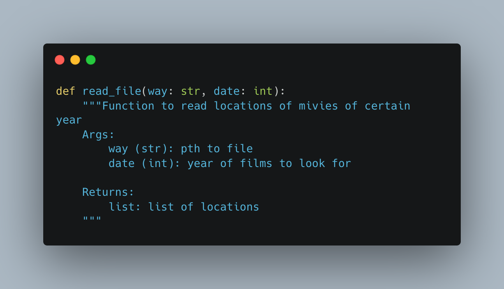

# map builder

Map builder is a module to create map with markers of movies of certin year, which are located closest to a certain point

## Usage

Enter required arguments into the comand line

```python
python3 /Users/julia/Desktop/OP/week_1/map/lab1_2.py 2014 49.83826 24.02324 'path to file with films'
```

## Fuctional




## Contributing

Any improvements are very welcomed!

## License

[MIT](https://choosealicense.com/licenses/mit/)